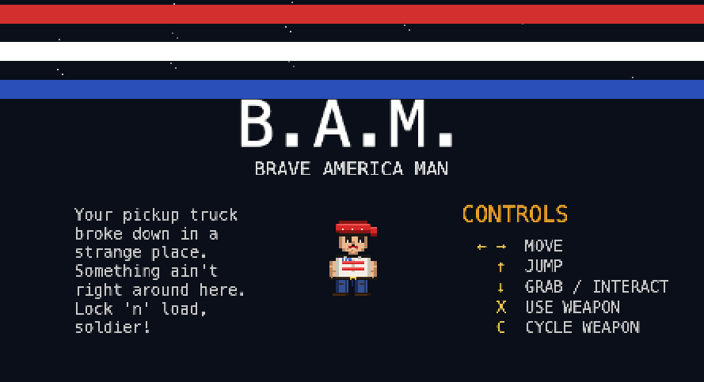

# Brave America Man (B.A.M.)



Viral political-satire video game. 8-bit sidescroller that looks like a violent shooter — until you realize the "enemies" are civilians, children, cops and the local church choir, and the "score" is your prison sentence.

> *"Man, what a night. Your pickup truck broke down in a strange town. Good thing
> you brought your guns. Lock 'n' load, soldier! Hoo-rah!"*

If you play through without stealing, drinking, doing drugs, breaking into houses or hurting anyone, everyone stays peaceful, the choir sings, and you actually **win**. Shoot the dog? Break down the door? The state is waiting for you.

## Quick start

```bash
# 1. Install backend deps (uv handles the Python env)
cd backend
uv sync

# 2. Run the server — it serves both the API and the static frontend
uv run python -m bam_backend

# 3. Open the game
open http://127.0.0.1:8000
```

Default host/port is `127.0.0.1:8000`. Override with `BAM_HOST` / `BAM_PORT` env vars. The SQLite DB lives at `backend/data/scores.db` — delete it to wipe the scoreboard.

## Controls

| Key                 | Action                     |
|---------------------|----------------------------|
| `←` / `→` / `A` `D` | Move left / right          |
| `↑` / `W`           | Jump                       |
| `↓` / `S`           | Grab pickup / interact     |
| `X`                 | Use current weapon         |
| `Z`                 | Cycle weapon               |
| `Tab` (splash)      | Scoreboard                 |
| `Esc`               | Back to splash             |

### Mobile / touch

Touch-capable devices get on-screen controls automatically — six buttons
(left / right / jump / down / fire / swap) overlaid at the screen corners,
plus a fullscreen toggle. Each button dispatches the same keyboard event
the desktop binding listens for (`frontend/js/mobile.js`), so no scene
code branches on input source. Fire doubles as menu-confirm (maps to
`space`) and Swap as `enter`, so the full splash → game → death flow works
thumbs-only. In portrait a "ROTATE DEVICE" overlay prompts landscape.

### The house

Midway through the level a house blocks the road. It's not part of the peaceful path — smash the front door with `X` and then press `↓` to step inside. The interior is a separate scene with the family and a
syringe on the cabinet; stand in front of the exit door on the left and press `↓` to return to the porch. Health, ammo, collected pickups and killed enemies
all persist across the trip.

### The arena (debug mode)

Open [http://127.0.0.1:8000/?debug](http://127.0.0.1:8000/?debug) to land in a single-screen sandbox for trying weapons, tuning feel, and stress-testing effects. It bypasses the splash, death and ending scenes entirely.

- **Invincible player** — you can't die, so you can sit in the middle of a crowd and test things.
- **Full arsenal** pre-equipped: fists, bat, handgun, shotgun, SMG, taser, flamethrower, grenade, molotov — 500 ammo each. Cycle with `C`, fire with `X`.
- **Enemies stream in** from the right and march left, hostile on sight. One of every kind rotates through, including SWAT. Cap is 40 concurrent; any that wander off the left edge are culled.
- **No scoring, no persistence** — runs here don't touch the scoreboard or `run` state. `Esc` returns to the splash.

## Architecture

```text
backend/                 Python 3.12+, Flask + SQLite, uv-managed
  bam_backend/
    app.py               API routes + static file serving
    store.py             ScoreStore facade over sqlite3
    __main__.py          uvicorn entry point
  data/scores.db         created on first run

frontend/                static assets, no build step
  index.html
  css/style.css
  js/
    main.js              KAPLAY bootstrap + scene registration
    scenes.js            splash / game / death / ending / scoreboard
    sprites.js           hand-painted pixel-art sprite factory
    api.js               scoreboard fetch/submit wrapper
    mobile.js            touch-controls overlay + fullscreen toggle
```

### Sprites

All sprites are painted procedurally from colour rects onto tiny offscreen canvases, then handed to KAPLAY as textures. No external art files, no placeholders — see `frontend/js/sprites.js` for the painter.

### Game engine

[KAPLAY](https://kaplayjs.com/) (maintained fork of Kaboom.js), loaded from CDN pinned at `3001.0.19`. ~60 KB gzipped. Handles sprites, physics, scenes and input; everything else is plain ES modules.

### Scoreboard

- `POST /api/scores` with `{name, ending, kills, time_ms, health, years}` — `ending` must be `win` or `crime`.
- `GET /api/scores/top?limit=50` — wins ranked by fastest time, then crimes ranked by prison sentence (satirical ordering: worst criminals make the wall of shame).

## Smoke test

No unit tests yet. Manual round-trip:

```bash
curl -s http://127.0.0.1:8000/api/health
curl -sX POST http://127.0.0.1:8000/api/scores \
  -H 'Content-Type: application/json' \
  -d '{"name":"TEST","ending":"win","kills":0,"time_ms":90000,"health":100,"years":0}'
curl -s http://127.0.0.1:8000/api/scores/top
```

## Deployment notes

- Single process — Flask runs natively as WSGI, so it drops straight into cPanel shared hosting via Passenger, or behind gunicorn / Caddy / Nginx on a tiny VPS. See `passenger_wsgi.py` at the repo root for the cPanel entry point, and `requirements.txt` for the pip-installable deps (cPanel doesn't speak `uv`).
- SQLite is fine for expected load. For higher write volumes, swap `ScoreStore` for a Postgres implementation — that's the only thing that needs to change.
- The frontend is entirely static and can be pushed to a CDN separately if desired.

## Next steps

- Music + SFX. KAPLAY supports `loadSound` / `play`; a chiptune loop and
  shot/hit/pickup cues would pull weight.

## License / distribution

All characters fictional. Commentary, not endorsement.
